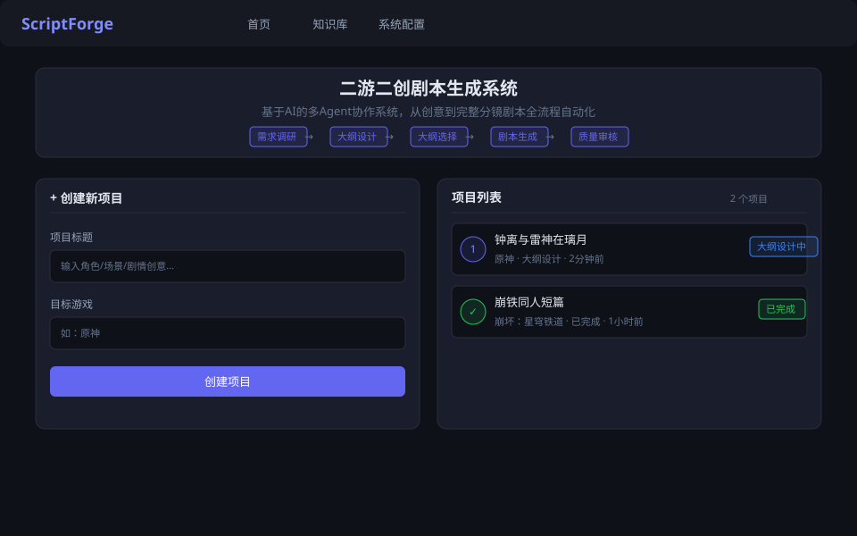
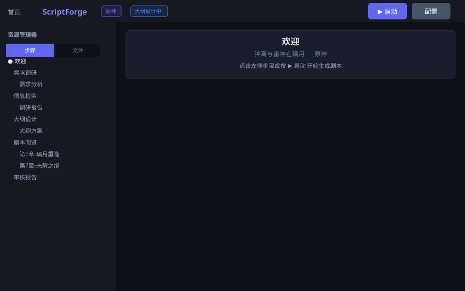
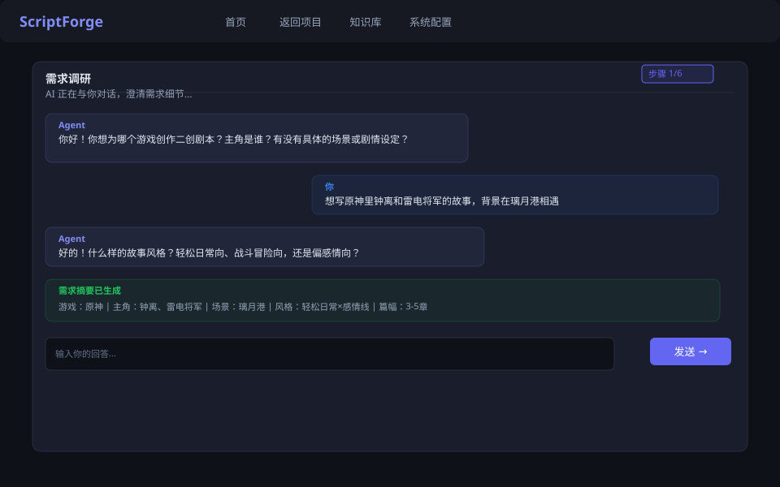
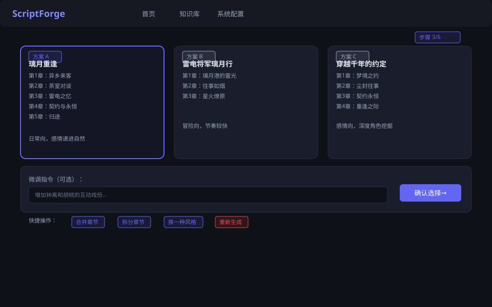
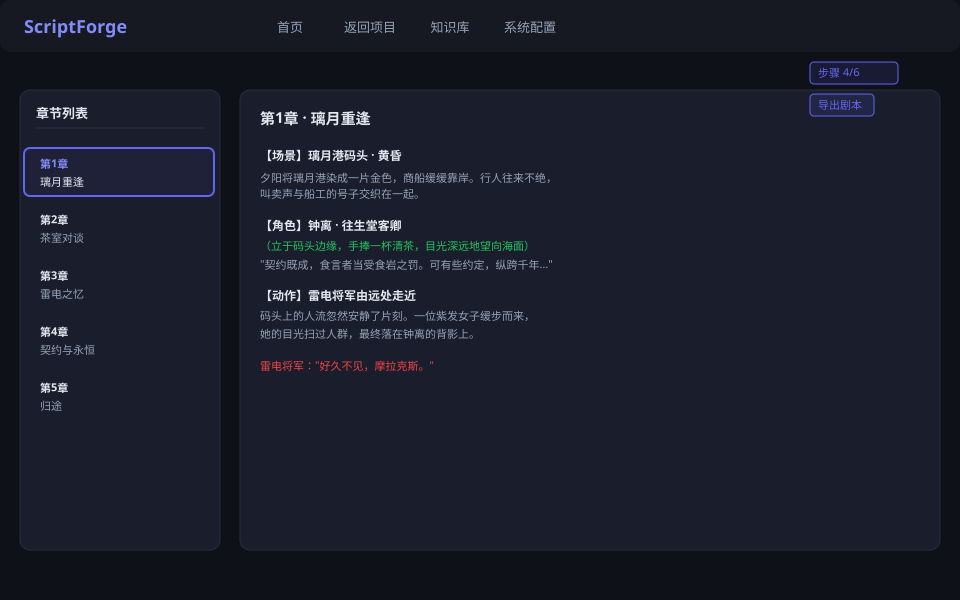
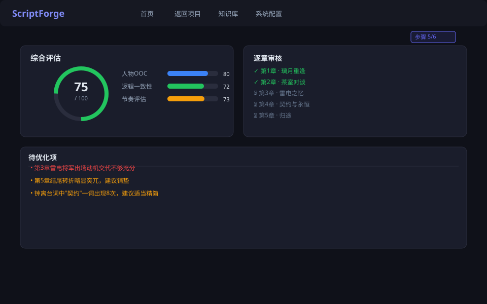
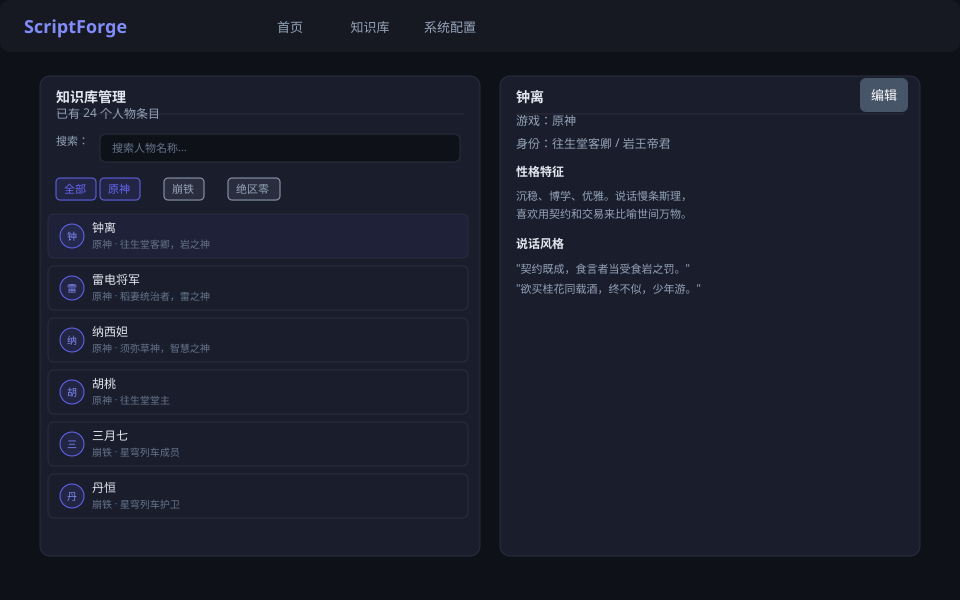
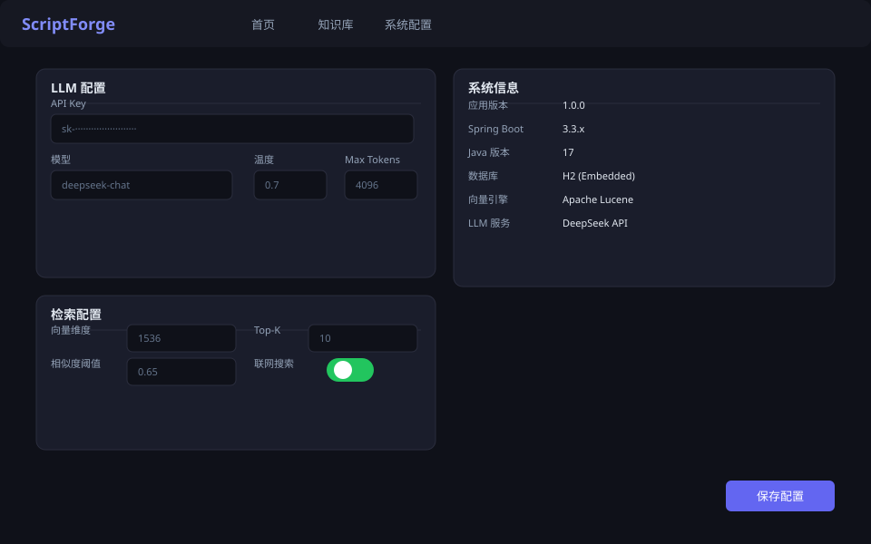

# ScriptForge

> 基于 Java + DeepSeek 的多 Agent 二次元游戏二创剧本生成系统

## 项目背景

本项目为 **Java 课程设计作业**，目的是帮同学完成一份能跑起来的 Spring Boot 项目。项目结合了大模型（DeepSeek）和多 Agent 协作模式，输入一句创意，自动完成从需求澄清、角色检索、大纲生成、分章创作到质量审核的全流程剧本生成。

> **注意**：本项目仅供课程演示和学习参考，存在较多 Bug 和未完善的功能，**不可用于生产环境**。

## 功能概览

- 输入创意 → 多轮需求澄清 → 结构化需求摘要
- 角色人设检索（Lucene 向量库）+ 实时网络搜索
- 生成多版大纲供选择，支持微调
- 逐章生成带场景、动作、台词的专业分镜剧本
- 自动审核 OOC / 逻辑 / 节奏问题
- 支持 Markdown / Word / PDF / TXT / SRT 多格式导出
- 进度实时推送（SSE），失败自动重试，支持断点续传

## 界面展示

| 首页 | 工作台 |
|------|--------|
|  |  |

| 需求调研 | 大纲选择 |
|----------|----------|
|  |  |

| 剧本阅览 | 审核报告 |
|----------|----------|
|  |  |

| 知识库 | 系统配置 |
|--------|----------|
|  |  |

## 技术栈

- **框架**: Spring Boot 3.3+
- **JDK**: Java 17+
- **构建**: Maven 3.9+
- **前端**: Thymeleaf + HTMX + SSE
- **数据库**: H2 Database（内嵌文件模式）
- **ORM**: Spring Data JPA + Hibernate
- **向量检索**: Apache Lucene（KNN/HNSW）
- **LLM**: DeepSeek API（对话 + Embedding）
- **文档导出**: Apache POI / PDFBox / CommonMark

## 快速开始

### 环境要求

- JDK 17+
- Maven 3.9+
- 可访问 `api.deepseek.com` 的网络
- 至少 4GB RAM

### 配置 API Key

编辑 `src/main/resources/application.yml`，将 `your-api-key-here` 替换为你的 DeepSeek API Key：

```yaml
deepseek:
    api-key: ${DEEPSEEK_API_KEY:your-api-key-here}
```

也可以通过环境变量设置：`DEEPSEEK_API_KEY=sk-xxxx`。

### 运行

```bash
# 进入项目目录（必须在 script-forge 目录下运行）
cd script-forge

# 方式一：Maven 插件直接运行
mvn spring-boot:run

# 方式二：打包后运行
mvn clean package -DskipTests
java -jar target/script-forge-1.0.0.jar
```

启动后访问 **http://localhost:8080**。

### IDEA 运行注意事项

直接在 IDEA 中运行 `ScriptForgeApplication` 时，需要确保 **Working directory** 设置为项目的 `script-forge` 目录（`$MODULE_WORKING_DIR$`），否则相对路径（`./exports`、`./data` 等）会解析到错误位置导致"找不到路径"错误。

## 项目结构

```
script-forge/
├── src/main/java/com/erchuang/scriptforge/
│   ├── ScriptForgeApplication.java       # 启动入口
│   ├── config/                            # 应用配置
│   ├── web/controller/                    # REST API + 页面路由
│   ├── agent/
│   │   ├── orchestrator/                  # 工作流编排
│   │   ├── requirement/                   # 需求调研 Agent
│   │   ├── search/                        # 实时搜索 Agent
│   │   ├── character/                     # 角色人设检索 Agent
│   │   ├── outline/                       # 大纲生成 Agent
│   │   ├── script/                        # 剧本创作 Agent
│   │   ├── review/                        # 质量审核 Agent
│   │   └── document/                      # 文档导出 Agent
│   ├── service/                           # 业务服务层
│   ├── model/{entity,dto,enums}/          # 领域模型
│   ├── repository/                        # 数据访问层
│   ├── llm/                               # DeepSeek 客户端 + Embedding
│   ├── vectordb/                          # Lucene 向量库
│   ├── export/                            # 多格式导出引擎
│   ├── ws/                                # WebSocket
│   ├── stream/                            # SSE 进度推送
│   └── infra/                             # 通用基础设施
├── src/main/resources/
│   ├── application.yml                    # 主配置
│   ├── templates/                         # Thymeleaf 页面
│   ├── static/{css,js}/                   # 静态资源
│   └── prompts/                           # LLM 提示词模板
└── pom.xml
```

## 已知问题

本项目为课程作业，存在以下已知问题：

- 部分 LLM 调用未做充分的异常处理和重试
- 前端交互较为简陋，缺乏加载状态提示
- 向量检索的准确率和召回率有优化空间
- 未做完善的并发控制，多项目同时运行时可能出现问题
- 相对路径依赖工作目录，跨环境部署不够健壮
- 缺少单元测试覆盖

欢迎提 Issue，但不保证及时修复。

## License

MIT
